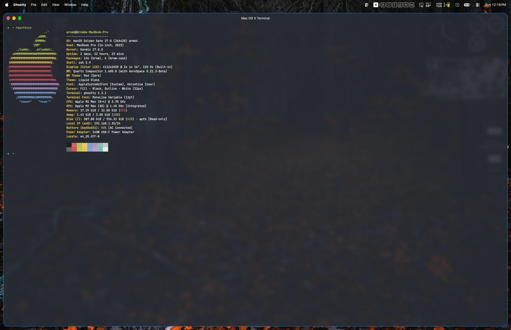
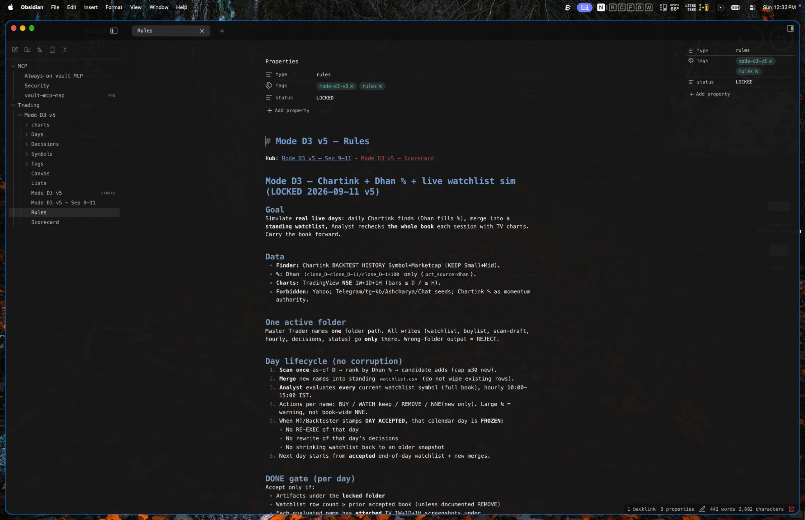
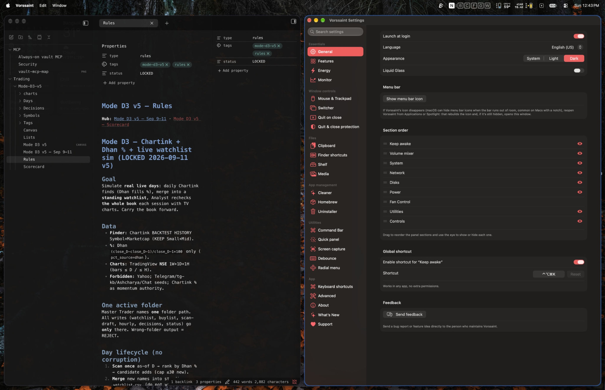

# Dotfiles

Mac configs I actually use. Ghostty for the terminal, AeroSpace for tiling, Leader Key when I don't want to hold Alt, Vorssaint for the menu bar, Raycast for jumping around, Oh My Zsh, and an Obsidian theme sampled from Ghostty's default dark palette so the two don't look like they came from different decades.

## Screenshots

Ghostty, Obsidian, then the tiling. Same palette, same font, same tab shape.

<p align="center">
  
</p>
<p align="center"><em>Ghostty. MonoLisa, block cursor, title still says Mac OS X Terminal.</em></p>

<p align="center">
  
</p>
<p align="center"><em>Obsidian. Ribbon gone, tabs like Ghostty, wallpaper only as a tint.</em></p>

<p align="center">
  
</p>
<p align="center"><em>AeroSpace. Rules note on the left, Vorssaint settings on the right. The blue ring is JankyBorders.</em></p>

## Wallpaper

The forest behind those windows. Orange leaves, dark trees. [Download](https://github.com/hurbes/dotfiles/raw/main/wallpaper/forest.jpg).

<p align="center">
  
</p>

## What's here

- `ghostty/config` is the terminal. MonoLisa, no ligatures, block cursor, a little blur.
- `aerospace.toml` is letter workspaces and i3-style keys. Alt-enter opens Ghostty. New windows get shoved onto a workspace instead of spawning on top of whatever I was doing.
- `leader-key/config.json` is the Leader Key tree. Caps Lock and L opens it. Most of the AeroSpace CLI lives under `a` and `w` so I don't have to bind every verb to Alt. `bin/macos-*` are the lock, sleep, and mute helpers those sequences call.
- `zsh/` is Oh My Zsh with robbyrussell, a big history, and fzf-tab so Tab is a fuzzy finder instead of a menu.
- `obsidian/` is the Ghostty theme, a chrome snippet that hides the ribbon, and the plugin settings that make the window feel closer to the terminal.
- `borders/bordersrc` is JankyBorders. AeroSpace starts it so the focused window has a ring.
- `vorssaint/Vorssaint Settings.plist` is a Vorssaint settings backup. Shortcuts, menu bar meters, screenshot keys, that kind of thing. Not clipboard history, not Scratchpad notes.
- `raycast/extensions.json` is the Store extensions I keep installed. Translate, Downloads Manager, Spotify Player, Color Picker, Ghostty, Lorem Ipsum, Speedtest, IP Geolocation. Hotkeys and aliases live in Raycast's encrypted databases, so they are not in this repo. Clipboard history and AI chats stay off GitHub.

MonoLisa is a paid font. Both Ghostty and Obsidian name it. If you don't have it, change the font lines.

## Install

Clone the repo, then run the script. It symlinks the files into place and copies Obsidian bits only if you point it at a vault.

```bash
git clone https://github.com/hurbes/dotfiles.git ~/dotfiles
cd ~/dotfiles
./install.sh
./install.sh --vault ~/Documents/YourVault
```

Existing files get a `.bak` suffix. The script does not touch your notes.

Apps and CLI tools from Homebrew:

```bash
brew bundle
```

Oh My Zsh is separate. Install that first, then rerun `./install.sh` so it can clone fzf-tab, zsh-autosuggestions, and zsh-syntax-highlighting. You also want `fzf`, `zoxide`, and `eza` on PATH, which the Brewfile covers.

In Obsidian, install Hider, Lacewing, Style Settings, and Mermaid Zoom from the community list. `mermaid-zoom-persist` is a small local plugin in this repo, so the copy step is enough.

Vorssaint is imported from inside the app, not by the script. Open Settings, Advanced, Import settings, and pick `vorssaint/Vorssaint Settings.plist`. It restarts the app. Clipboard history and Scratchpad stay on the old Mac.

Raycast is the same story. Install the app, then install each extension from `raycast/extensions.json`. You can search the Store or open the `install` deeplink once Raycast is running. For hotkeys and aliases, run Export Settings & Data in Raycast, uncheck Clipboard History and AI, and keep that `.rayconfig` somewhere private. Don't put it in this repo.

Leader Key is a Homebrew cask. `install.sh` writes `leader-key/config.json` into `~/Library/Application Support/Leader Key/` and links the tiny `bin/macos-*` scripts into `~/.local/bin`. Open the app once, set the leader shortcut to Caps Lock and L, and pick the breadcrumbs theme if you want the same cheatsheet. Caps Lock is Hyper on this Mac. That remap is not in this repo.

## Workspaces

I skip H, J, K, and L because those keys move focus.

| Key | What I put there |
| --- | --- |
| B | browsers |
| D | Docker |
| G | Ghostty |
| I | Imark |
| N | Obsidian |
| S | Free Download Manager |
| W | WhatsApp |

The rest are free. Alt plus the letter jumps to it. Alt-shift plus the letter takes the current window with you.

## Leader Key and AeroSpace

AeroSpace already owns Alt. Workspace jumps, focus, and dragging a window with me are chords I hit without looking. If I piled every layout command onto Alt I'd start colliding with apps, and I'd forget half of them.

Leader Key is the overlay. Caps Lock and L opens a labeled tree. I type a short sequence instead of holding modifiers. AeroSpace still does the tiling. Leader Key just shells out to `/opt/homebrew/bin/aerospace`. The overlay is the cheatsheet.

Daily muscle memory stays in AeroSpace. Alt-g is Ghostty. Alt-n is Obsidian. Alt-h/j/k/l moves focus. Alt-shift plus a letter takes the focused window with me. Those stay chords because I hit them constantly.

Leader Key is the long tail, and launching.

- `w` then a letter jumps workspaces when I don't want to hold Alt, or I blanked on which letter is which. `w q` is back and forth.
- `a` is AeroSpace verbs I don't want as global chords. `a w h` swaps with the window on the left. `a m n` moves this window to notes and follows. `a l t` flips tiles. `a s v` splits vertical. `a j l` joins right. `a x o` closes everything else on the workspace. `a r` reloads the config.
- `p` is project slots. `p n` is a new Cursor window. `p t` is a new Ghostty. Then `p a` through `p e` (and s, w, x) parks that window on a workspace and goes there. A fresh Cursor still gets assigned to C by `on-window-detected`. The slot keys are for when I want three Cursor windows on A, S, and X instead of stacking them all on C.
- `t`, `c`, `b` launch Ghostty, Cursor, Dia. AeroSpace puts them on G, C, B. Focus stays on the workspace I was in, which is what I want when I'm firing something off in the background.
- `o`, `s`, `m`, `u`, `d` are apps, system, media, URLs, folders. Not tiling. Lock screen is `s l`. They're here so I don't also keep a Raycast alias for the same things.

Raycast is still search. If I remember the sequence, Leader Key is faster. If I don't, I search.

## A couple of opinions

I kept the Ghostty title "Mac OS X Terminal" because I think it's funny. The padding and cell height are fussy on purpose. Default Ghostty feels a bit tight on a Retina screen.

Obsidian translucency is easy to overdo. The theme uses a high alpha so you get a tint of the wallpaper, not the wallpaper showing through your notes. The snippet keeps blur off the editor scroller. Blur on that layer made scrolling flicker.

LiveSync is not in this repo. That's a private sync setup and it does not belong on GitHub.
